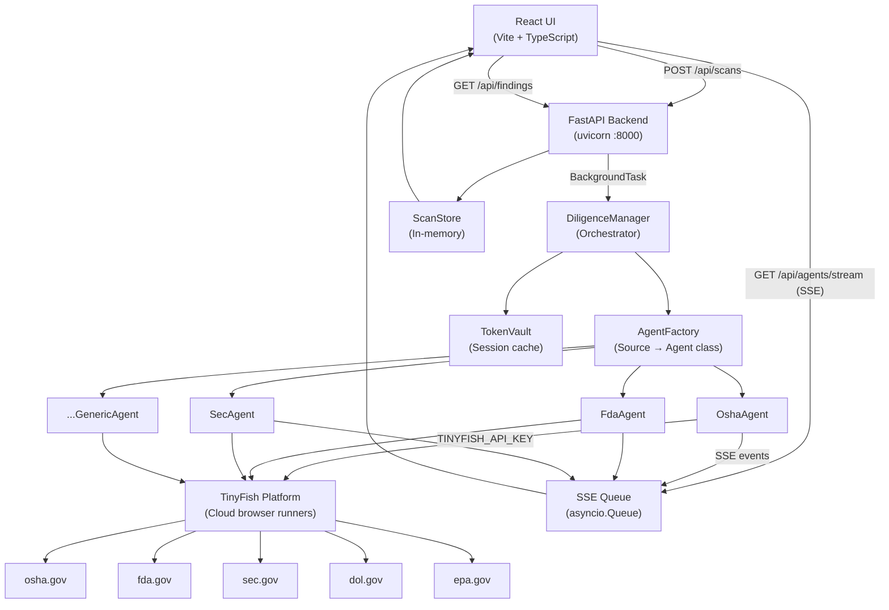
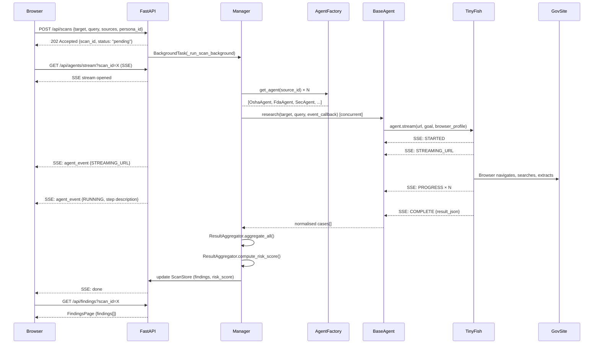
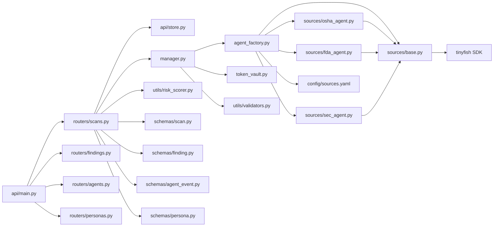

# AutoDiligence — Project Architecture

> **AutoDiligence** is a multi-agent regulatory research engine that wraps [TinyFish Web Agent](https://docs.tinyfish.ai/) capabilities to automate due-diligence scraping across US federal enforcement portals (OSHA, FDA, SEC, DOL, EPA). A single API call fans out to N concurrent browser agents, streams live events over SSE, normalises results, and scores overall entity risk.

---

## 1. High-Level System Diagram



---

## 2. Layered Architecture

The system is divided into five clean layers:

| Layer | Location | Responsibility |
|---|---|---|
| **Presentation** | `ui/` | React SPA — scan creation, live agent log, findings table, risk score |
| **API** | `src/api/` | FastAPI routers, Pydantic schemas, CORS, SSE endpoint |
| **Orchestration** | `src/manager.py`, `src/agent_factory.py` | Task decomposition, concurrency, result aggregation |
| **Agent** | `src/sources/` | TinyFish API calls, goal rendering, result normalisation |
| **Infrastructure** | `src/token_vault.py`, `config/` | Session state, evasion profiles, source registry |

---

## 3. Request Lifecycle



---

## 4. Concurrency Model

```
asyncio event loop (FastAPI / uvicorn)
│
├── Route handler: POST /api/scans  ─────────── returns immediately (202)
│   └── BackgroundTask: _run_scan_background()
│       └── await manager.research()
│           └── asyncio.gather(*[
│                   asyncio.to_thread(agent.research, ...)   ← thread per source
│                   asyncio.to_thread(agent.research, ...)   ← thread per source
│                   ...up to max_concurrent_agents (default 5)
│               ])
│
└── Route handler: GET /api/agents/stream  ──── held open for SSE
    └── AsyncGenerator: reads asyncio.Queue per scan_id
        ← events pushed thread-safely via asyncio.run_coroutine_threadsafe()
```

**Key design decision:** TinyFish SDK uses synchronous HTTP streaming (blocking `for event in stream`). Each agent runs in a thread via `asyncio.to_thread()`, then bridges back to the event loop via `run_coroutine_threadsafe()` for SSE delivery.

---

## 5. Component Dependency Graph



---

## 6. Key Design Principles

### A. TinyFish as the Browser Runtime
AutoDiligence **never runs a local browser**. All web navigation, authentication, and data extraction runs on the TinyFish cloud platform. The system's job is to compose smart natural-language goals and process what comes back.

### B. Goal-First Programming
Each agent expresses its intent as a human-readable paragraph (a "goal"). TinyFish figures out how to click, search, and extract. This makes adding new regulatory sources as simple as writing a new `_build_goal()` method.

### C. Event-Driven Observability
Every TinyFish SDK event (STARTED, STREAMING_URL, PROGRESS, COMPLETE) is forwarded in real-time to the UI via SSE. Users watch agents work live—they can even embed the live browser stream in the UI via an `<iframe>` from the STREAMING_URL.

### D. Source-Agnostic Orchestration
The `DiligenceManager` knows nothing about individual sites. It hands source IDs to `AgentFactory`, which maps them to the right agent class and YAML config. Adding a new source (e.g., FTC) requires:
1. A new entry in `config/sources.yaml`
2. A new `FtcAgent` class in `src/sources/`
3. Registration in `AgentFactory._AGENT_REGISTRY`

### E. Stateful Session Reuse (TokenVault)
When multiple agents log into the same site, the second agent reuses the first's cookies via `TokenVault`, avoiding redundant login flows. Supports both in-memory (dev) and Redis (production) backends.
