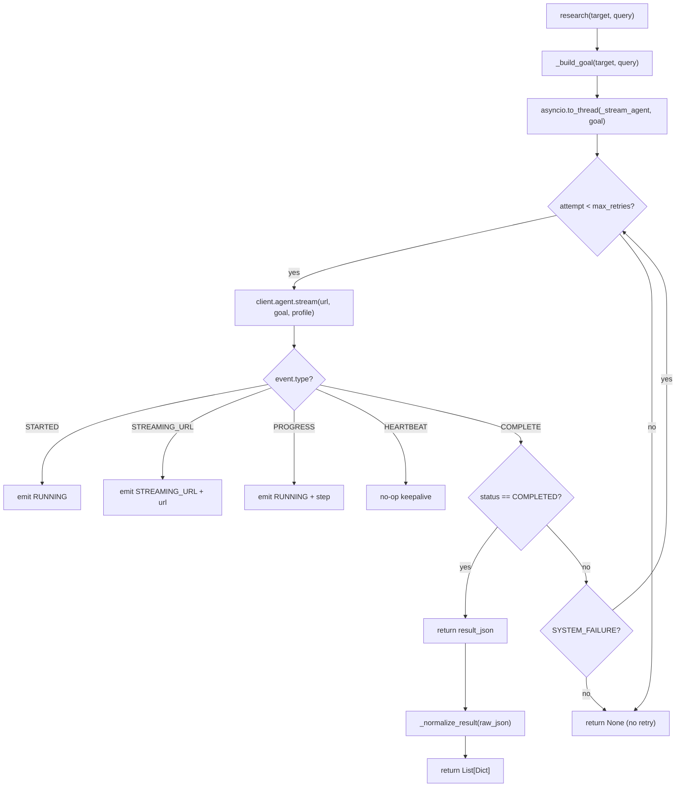

# AutoDiligence — Backend Components Reference

---

## 1. `src/manager.py` — DiligenceManager

The central orchestrator. Receives a research request and fans it out to multiple concurrent agents.

### Class: `DiligenceManager`

```python
DiligenceManager(
    sources: List[str],
    max_concurrent_agents: int = 10,
    use_token_vault: bool = True,
    token_vault_ttl: int = 3600,
    redis_client: Optional[redis.Redis] = None,
    evasion_profile: Optional[str] = None,
)
```

| Parameter | Default | Description |
|---|---|---|
| `sources` | required | List of source IDs to query (`us_osha`, `us_fda`, etc.) |
| `max_concurrent_agents` | `10` | Thread-pool size; limits parallel TinyFish calls |
| `use_token_vault` | `True` | Enable session-reuse via TokenVault |
| `token_vault_ttl` | `3600` | Cookie TTL in seconds |
| `redis_client` | `None` | If set, uses Redis for distributed session storage |
| `evasion_profile` | `None` | Default evasion profile name from `evasion_profiles.yaml` |

### Key Methods

#### `async research(target, query, sources?, callback?, event_callback?) → Dict[str, ResearchResult]`

Main entry point. Validates input, creates `ResearchTask` objects, and runs them concurrently via `asyncio.gather`.

**Returns:** `{source_id: ResearchResult}` mapping.

```python
results = await manager.research(
    target="Tesla Inc",
    query="workplace safety violations",
    event_callback=lambda src_id, tag, msg, url: ...,
)
```

#### `_create_tasks(target, query, sources) → List[ResearchTask]`

Creates one `ResearchTask` per source. Each task gets a unique `task_id` composed of `task_{source_id}_{timestamp}_{index}`.

#### `async _execute_tasks(tasks, callback, event_callback) → Dict[str, ResearchResult]`

Wraps each task in `asyncio.to_thread(agent.research, ...)` and gathers them with a semaphore for concurrency control.

### Dataclasses

```python
@dataclass
class ResearchTask:
    task_id: str          # "task_us_osha_1711435200_0"
    source_id: str        # "us_osha"
    target: str           # "Tesla Inc"
    query: str            # "workplace safety violations"
    priority: int = 5     # reserved for future prioritised scheduling
    metadata: Dict        # extensible metadata bag

@dataclass
class ResearchResult:
    task_id: str
    source_id: str
    status: str           # "completed" | "failed" | "partial"
    data: List[Dict]      # normalised case dicts
    error: Optional[str]  # error message if failed
    execution_time: float # wall-clock seconds
    tokens_used: int      # reserved (not yet populated)
```

---

## 2. `src/agent_factory.py` — AgentFactory

Maps source IDs to agent classes, loads YAML config, caches instances per scan.

### Agent Registry

```python
_AGENT_REGISTRY = {
    "us_osha": OshaAgent,
    "us_fda":  FdaAgent,
    "us_sec":  SecAgent,
    # extend here for new sources
}
```

Sources not in the registry get a fallback `OshaAgent`-style generic implementation with a warning log.

### Class: `AgentFactory`

```python
AgentFactory(token_vault=None, default_profile=None)
```

- `get_agent(source_id)` — returns a cached or newly created agent
- `_create_agent(source_id)` — loads `SourceConfig` from YAML, instantiates agent class
- `active_count()` — number of cached agent instances
- `clear()` — purge cache (called at scan end)

### `SourceConfig` (dataclass)

Loaded from `config/sources.yaml`:

```python
@dataclass
class SourceConfig:
    id: str                    # "us_osha"
    name: str                  # "US OSHA Enforcement Records"
    base_url: str              # "https://www.osha.gov/enforcement"
    category: str              # "workplace_safety"
    login_flow: str            # "none" | "username_password"
    browser_profile: str       # "LITE" | "STEALTH"
    search_goal_template: str  # Jinja2-style template with {{company_name}}
    proxy: Dict                # proxy config dict
    rate_limit: Dict           # max_requests_per_minute, jitter_ms
    retry_policy: Dict         # max_retries, backoff_seconds
```

---

## 3. `src/sources/base.py` — BaseAgent

Abstract base class all site agents inherit from.

### Lifecycle



### Abstract Methods

```python
@abstractmethod
def _build_goal(self, target: str, query: str) -> str:
    """Return the natural-language goal for TinyFish."""

@abstractmethod  
def _normalize_result(self, raw_json: Dict[str, Any]) -> List[Dict[str, Any]]:
    """Map TinyFish result_json → list of normalised case dicts."""
```

### Event Emission

The `_emit(tag, message, streaming_url?)` method forwards events to both the logger and the SSE callback chain:

```
BaseAgent._emit()
  → self._event_callback(source_id, tag, message, url)
    → asyncio.run_coroutine_threadsafe(scan_store.push_event(...), loop)
      → SSE queue → EventSourceResponse → Browser
```

### Retry Logic

- Retries happen on `SYSTEM_FAILURE` categories only
- `AGENT_FAILURE` (agent couldn't complete the task) does **not** retry
- Jitter from `rate_limit.jitter_ms` is applied before each attempt to avoid thundering-herd

---

## 4. `src/sources/` — Site Agents

### OshaAgent (`osha_agent.py`)

- **Target:** `https://www.osha.gov/enforcement`
- **Browser profile:** STEALTH (OSHA has aggressive bot detection)
- **Goal:** Searches for inspection/citation records by employer name
- **Extracts:** `case_id`, `employer_name`, `violation_type`, `proposed_penalty`, `decision_date`, `status`, `jurisdiction`, `description`, `source_url`
- **Normalisation:** maps `violation_type` values (`serious`, `willful`, `repeat`, `other-than-serious`) directly

### FdaAgent (`fda_agent.py`)

- **Target:** `https://www.fda.gov/.../warning-letters`
- **Browser profile:** LITE
- **Goal:** Searches FDA warning letters and enforcement actions
- **Extracts:** Same schema as OSHA; `violation_type` values include `GMP`, `labeling`, `adulteration`
- **Normalisation:** ensures `jurisdiction` is set to `"US Federal (FDA)"`

### SecAgent (`sec_agent.py`)

- **Target:** `https://www.sec.gov/divisions/enforce/enforcements.htm`
- **Browser profile:** LITE
- **Goal:** Searches SEC enforcement actions, litigation releases, orders
- **Extracts:** `case_id` (SEC release number), `violation_type` (fraud, disclosure, insider trading), `proposed_penalty` (disgorgement + civil penalty)
- **Normalisation:** sets `jurisdiction` to `"US Federal (SEC)"`, defaults `source` field to `"SEC"`

### Adding a New Agent

1. Add config entry in `config/sources.yaml`
2. Create `src/sources/ftc_agent.py` inheriting `BaseAgent`
3. Implement `_build_goal()` and `_normalize_result()`
4. Register in `AgentFactory._AGENT_REGISTRY["us_ftc"] = FtcAgent`

---

## 5. `src/token_vault.py` — TokenVault

Centralized session cache to share browser cookies across agents accessing the same site.

### Class: `TokenVault`

```python
TokenVault(redis_client=None, default_ttl=3600)
```

| Method | Description |
|---|---|
| `save(site_id, cookies, ttl?, refresh_token?, metadata?)` | Store a session |
| `get(site_id) → Optional[SessionToken]` | Retrieve if not expired |
| `refresh(site_id, new_cookies, ttl?)` | Update existing session |
| `invalidate(site_id)` | Delete a session |
| `list_active() → Dict[str, SessionToken]` | List all live sessions |

### `SessionToken` dataclass

```python
@dataclass
class SessionToken:
    site_id: str
    cookies: Dict[str, Any]    # Playwright format cookies
    created_at: datetime
    expires_at: datetime
    refresh_token: Optional[str]
    metadata: Optional[Dict]   # user-agent, IP, etc.

    def is_expired() -> bool
    def ttl_seconds() -> int
    def to_dict() / from_dict()  # JSON serialisation for Redis
```

### Storage Backends

```
TokenVault
├── Redis (distributed)     ← if redis_client provided
│   key: "autodiligence:token:{site_id}"
│   value: JSON serialised SessionToken
│   expiry: TTL seconds (set via SETEX)
│
└── In-memory dict          ← fallback (single-process only)
    _local_cache: Dict[str, SessionToken]
    (expired tokens cleaned on get())
```

### Factory Function

```python
# Used by DiligenceManager to get the right backend
vault = get_token_vault(redis_client=None, default_ttl=3600)
```

---

## 6. `src/tinyfish_runner.py` — Standalone Runner

A standalone module for testing/debugging TinyFish calls directly, without the full FastAPI stack.

### Usage

```bash
# Standalone execution (demos TinyFish connectivity)
python -m src.tinyfish_runner

# Import for programmatic use
from src.tinyfish_runner import run_agent, run_agent_async
```

### `run_agent(url, goal, browser_profile, verbose) → Optional[Dict]`

Synchronous. Streams all SSE events to stdout and returns `result_json` on success.

### `run_agent_async(url, goal, browser_profile, verbose) → Optional[Dict]`

Async wrapper using `asyncio.to_thread()` — same as how `BaseAgent` calls TinyFish.

### TinyFish Event Flow (confirmed from SDK)

```
STARTED → STREAMING_URL → PROGRESS (×N) → HEARTBEAT (×N) → COMPLETE
```

> **Note:** There is no `ERROR` event type in the TinyFish SDK. Failures arrive as `COMPLETE` with `event.status != RunStatus.COMPLETED` and `event.error.category` set to either `AGENT_FAILURE` or `SYSTEM_FAILURE`.

---

## 7. `src/utils/` — Utilities

### `validators.py`

```python
validate_request(target: str, query: str) -> ValidationResult
```

Checks:
- `target` is non-empty, 2–500 chars
- `query` is non-empty, ≤ 2000 chars

Returns `ValidationResult(is_valid, errors[])`.

### `prompts.py`

Reusable goal templates:

| Function | Description |
|---|---|
| `build_generic_enforcement_goal(company, date_from, date_to)` | Generic enforcement search prompt |
| `build_login_goal(username, password)` | Standard login flow prompt |
| `render_goal_template(template, filters)` | Replace `{{key}}` placeholders |

### `risk_scorer.py`

See [wiki 85-risk-scoring.md](85-risk-scoring.md) for full details.

---

## 8. `src/api/store.py` — ScanStore

In-memory singleton that holds all scan state for the process lifetime.

```python
class ScanStore:
    _scans: Dict[str, ScanResponse]         # scan metadata
    _findings: Dict[str, List[Finding]]     # findings per scan
    _event_queues: Dict[str, asyncio.Queue] # live SSE queue per scan (max 500 events)
    _event_history: Dict[str, List[AgentEvent]]  # never-drained history for late-joiners
    _lock: asyncio.Lock
```

### Key Methods

| Method | Description |
|---|---|
| `create(scan)` | Register new scan, allocate queue |
| `get(scan_id)` | Fetch scan by ID |
| `list_all()` | All scans |
| `update(scan_id, **kwargs)` | Immutable update via `model_copy` |
| `add_findings(scan_id, findings)` | Append findings |
| `get_findings(scan_id)` | Return findings list |
| `push_event(event)` | Add SSE event to queue + history |
| `get_event_queue(scan_id)` | Get live asyncio.Queue |
| `get_event_history(scan_id)` | All events ever emitted |
| `close_event_queue(scan_id)` | Send `None` sentinel to end SSE stream |

> **Production note:** Replace with a PostgreSQL/SQLite-backed store for persistence across restarts.
