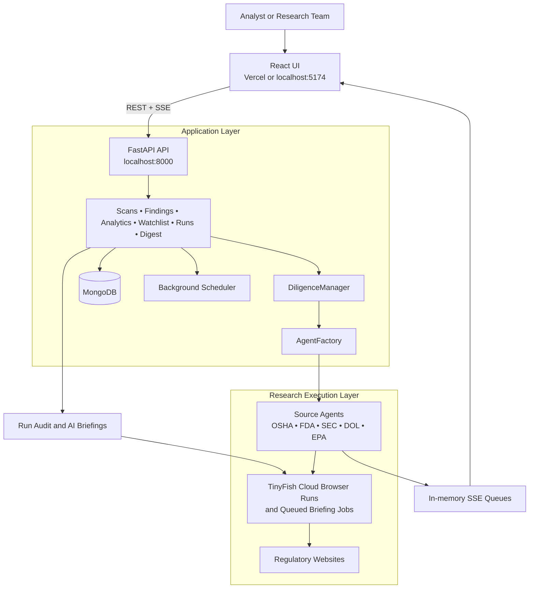

<div align="center">
  

  # AutoDiligence

  **Multi-agent regulatory research engine powered by TinyFish browser agents.**

  [](#)
  [](#)
  [](#)
  [](#)
  
  <h3>
    <a href="https://auto-diligence-tinyfish.vercel.app/">
      🚀 View Live Demonstration
    </a>
  </h3>
</div>

---

AutoDiligence is a regulatory due-diligence application that uses **TinyFish-powered browser agents** to research companies across multiple public enforcement and compliance sources. It combines concurrent scan orchestration, live agent telemetry, risk scoring, analytics, watchlist monitoring, and AI-generated briefings into a single FastAPI + React application.

## 🎯 Overview

Given a target company and a specialized "persona", AutoDiligence can:

- 🎏 **Fan out research** across multiple regulatory sources concurrently.
- 📺 **Stream live agent activity** and browser sessions directly back to the UI.
- 🗃️ **Normalize findings** into a single, unified data model.
- 🧮 **Compute an aggregated risk score** in a portfolio-style view.
- 💾 **Persist completed scans** and findings into MongoDB.
- 🤖 **Generate AI briefings** seamlessly from queued TinyFish runs.

---

## 🐟 Why TinyFish?

TinyFish is the execution layer behind the product, not just an integration point. 

> *Cloud-hosted browser execution removes the need to operate local browsers or scraping infrastructure.*

- **Browser-first Navigation:** Source agents use TinyFish browser runs to navigate complex regulatory sites that do not expose clean APIs.
- **Real-time Telemetry:** Live scan progress and actual browser session URLs flow directly from TinyFish into the dashboard through Server-Sent Events (SSE).
- **Run Audit & Observability:** The Run Audit panel provides a direct operational view of TinyFish run history, status, timing, and raw outputs.
- **Asynchronous Briefings:** AI Briefings rely on queued TinyFish runs and intelligent polling, ensuring long-running research completes reliably without blocking the UI.

---

## ⭐ Feature Highlights

- **⚡ TinyFish-First Execution:** Concurrent browser research, live run telemetry, and queued AI briefings powered natively by TinyFish.
- **🎭 Persona-Based Scans:** Preconfigured profiles built with distinct sources, default queries, and demo targets.
- **🏎️ Concurrent Execution:** Rapid parallel scan execution orchestrated via `DiligenceManager` and our source-specific agents.
- **📊 Interactive Findings:** Deep exploration powered by a robust findings table, timeline view, data exports, and executive-report formats.
- **📈 Advanced Analytics:** Risk scoring, portfolio overview, industry benchmarks, and trend analysis views.
- **👁️ Watchlist & Scheduling:** Proactive watchlist management with stale-entry detection and a background worker that auto-queues rescans for outdated entities.

---

## 💻 Tech Stack

<table>
  <tr>
    <td width="50%">
      <b>Backend</b><br>
      • Python 3.11+<br>
      • FastAPI<br>
      • TinyFish SDK<br>
      • asyncio & Pydantic v2<br>
      • MongoDB (via <code>pymongo</code> / <code>motor</code>)<br>
      • SSE (via <code>sse-starlette</code>)
    </td>
    <td width="50%">
      <b>Frontend</b><br>
      • React 18<br>
      • TypeScript<br>
      • React Router<br>
      • Webpack Dev Server<br>
      • Lucide React Icons
    </td>
  </tr>
</table>

### Configuration and Support
- **YAML** config for regulatory sources and anti-bot evasion profiles.
- **`python-dotenv`** for easy environment bootstrapping.
- **Token Vault** with optional Redis-backed shared session caching.

---

## 🏛️ Architecture



### Architecture Notes

- The React UI talks to FastAPI over standard REST endpoints plus SSE for live agent activity.
- TinyFish is the execution backbone for both browser-based source research and queued AI briefing jobs.
- MongoDB persists scans and findings, while live SSE event queues remain in memory for active sessions.

### Backend Flow

1. **Initiate:** `POST /api/scans` creates a pending scan and stores it in the database.
2. **Dispatch:** A background task hands the scan to the `DiligenceManager`.
3. **Fan-out:** The manager distributes work concurrently across the selected regulatory sources.
4. **Execution:** Source agents call TinyFish API and emit live events back into the in-memory SSE queue.
5. **Persistence:** Findings are normalized, scored, and reliably persisted to MongoDB.
6. **Consumption:** The React UI tracks scan status, findings, analytics, run history, and digest results via REST & SSE.

---

## 🏛️ Current Source Coverage

Configured regulatory sources located in [`config/sources.yaml`](config/sources.yaml):

- 👷 **`us_osha`** — OSHA enforcement records
- 💊 **`us_fda`** — FDA warning letters and enforcement
- 📈 **`us_sec`** — SEC enforcement actions
- ⚖️ **`us_dol`** — Department of Labor wage and hour violations
- 🌿 **`us_epa`** — EPA enforcement and compliance

---

## 🎭 Personas & Use Cases

The app ships with six built-in personas available in [`src/api/schemas/persona.py`](src/api/schemas/persona.py):

| Persona | Default Sources | Primary Use Case |
| :--- | :--- | :--- |
| **Compliance Officer** | OSHA, FDA, SEC, DOL, EPA | Board-level risk reviews, annual compliance sweeps, and enterprise exposure reporting. |
| **M&A Analyst** | SEC, OSHA, EPA | Pre-acquisition target screening, liability discovery, and valuation diligence. |
| **ESG Researcher** | EPA, OSHA, DOL | Environmental, labor, and governance screening for ESG scoring and investment research. |
| **Legal Counsel** | SEC, FDA, OSHA | Litigation preparation, case-status review, settlement history, and enforcement exposure. |
| **Investigative Journalist** | All Sources | Pattern-of-conduct research, repeat-violation tracking, and escalation analysis. |
| **Supply Chain Auditor** | OSHA, EPA, DOL | Supplier onboarding, vendor reviews, and manufacturing compliance risk assessment. |

---

## 💡 Typical Use Cases

> **Scenario 1:** Run a board-ready compliance review across all major federal enforcement sources with *one* TinyFish-backed scan.

> **Scenario 2:** Screen an acquisition target for unresolved liabilities before deeper legal and financial diligence begins.

> **Scenario 3:** Build comprehensive ESG research packets from EPA, OSHA, and DOL findings without manually navigating each agency portal.

> **Scenario 4:** Monitor suppliers and watchlist entities over time, triggering TinyFish-powered briefings when new risks emerge.

---

## ⚙️ Prerequisites & Installation

### Prerequisites

- **Python 3.11** or newer
- **Node.js 18** or newer
- **A TinyFish API key**
- A reachable **MongoDB** instance

### Setup

```bash
# 1. Clone the repository
git clone <your-repo-url>
cd auto-diligence-tinyfish

# 2. Set up the backend
python -m venv .venv
source .venv/bin/activate
pip install -r requirements.txt

# 3. Set up the frontend
cd ui
npm install
cd ..
```

### Configuration

Create a root `.env` file for the backend:

```env
TINYFISH_API_KEY=your_tinyfish_api_key
MONGODB_URI=your_mongodb_connection_string
MONGODB_DB=autodiligence
CORS_ORIGINS=http://localhost:5174,http://127.0.0.1:5174
DIGEST_QUEUE_TIMEOUT_SECONDS=15
```

If you want the frontend to call a remote API directly (instead of proxying via dev server), create `ui/.env`:
```env
REACT_APP_API_URL=http://localhost:8000
```

---

## 🚀 Running Locally

**Start the backend:**
```bash
source .venv/bin/activate
uvicorn src.api.main:app --reload --port 8000
```

**Start the frontend (in a separate terminal):**
```bash
cd ui
npm run dev
```

**Access the application at:** 
- Frontend: `http://localhost:5174`
- API docs: `http://localhost:8000/docs`
- Health check: `http://localhost:8000/api/health`
- **Hosted App:** [auto-diligence-tinyfish.vercel.app](https://auto-diligence-tinyfish.vercel.app/)

---

## 🗺️ Common Workflows

### 🔍 Start a New Scan
1. Open the **New Scan** page.
2. Select a persona or choose sources manually.
3. Enter a target company (or pick a demo target).
4. Submit the scan and watch the live agent log and browser streams in the dashboard!

### 📈 Review Results
- Inspect the **findings table** and interactive timeline.
- Read the computed **risk score** and label.
- Export to **CSV** or open the auto-generated **executive report**.
- Add critical targets to the **watchlist** for continuous monitoring.

### 🧠 Leverage AI Briefings & Run Audit
The **AI Briefings panel** queues TinyFish runs and intelligently polls the Run Audit API until the final intelligence product is ready. This powers portfolio briefings, entity deep-dives, risk-spike explanations, and geo-targeted scans.

The **Run Audit panel** provides comprehensive insights into queued/completed TinyFish runs, detailed duration metrics, live stream URLs, and full raw JSON outputs.

---

## 🛠️ Development & API

<details>
<summary><b>View Major API Routes</b></summary>

- `/api/scans` — create, list, inspect, rerun, and cancel scans
- `/api/findings` — access findings, CSV export, summaries, and executive reports
- `/api/agents` — live event streams (SSE), history, and status
- `/api/personas` — fetch persona presets
- `/api/watchlist` — discrete watchlist management
- `/api/analytics` — portfolio, benchmark, search, and trend data
- `/api/scheduler` — manage the background re-scan scheduler
- `/api/runs` — fetch TinyFish run lists, details, and metrics
- `/api/digest` — entrypoints for intelligent AI briefings
</details>

**Notes:**
- Frontend relies on Webpack Dev Server (`5174`) proxying `/api` traffic to FastAPI (`8000`).
- The scheduler runs on FastAPI lifespan startup, checking for stale watchlist entities every 30 minutes (defined as >7 days untouched).
- Source registry relies on [`config/sources.yaml`](config/sources.yaml).

---

## 🔧 Useful Commands

**Backend Checks:**
```bash
source .venv/bin/activate
python -m src.tinyfish_runner
pytest
pytest test_all_features.py
pytest test_penalty.py
```

**Frontend Checks:**
```bash
cd ui
npx tsc --noEmit
npm run build
```

---

<div align="center">
  <small>See <a href="LICENSE">LICENSE</a> for details.</small>
</div>